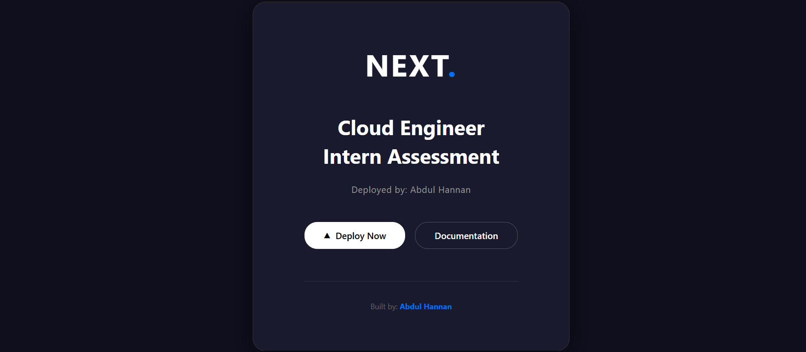
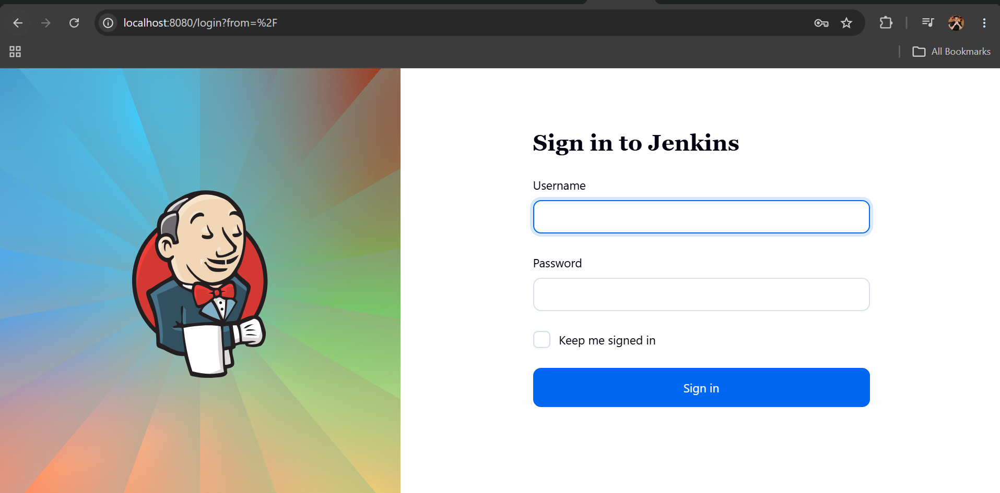

# 🚀 CloudLit Cloud Engineer Intern Assessment

This repository contains a practical implementation of a Cloud Engineering assessment using **Next.js, Docker, and Jenkins (via Docker Compose)**.

---

## 👨‍💻 Candidate
**Name:** Abdul Hannan  

---

## 📌 Project Overview

This project demonstrates:

- Next.js application development
- Containerization using Docker (Multi-stage build)
- CI/CD tool setup using Jenkins via Docker Compose
- GitHub version control best practices

---

## 🧱 Tech Stack

- Next.js (React Framework)
- Docker
- Docker Compose
- Jenkins (LTS Image)
- Git & GitHub

---

## 📁 Project Structure

```

cloudlit-assesment/
│
├── nextjs-app/
│   ├── app/
│   ├── Dockerfile
│   ├── .dockerignore
│   └── package.json
│
├── compose.yaml
│
├── screenshots/
│   ├── nextjs.png
│   └── jenkins.png
│
└── README.md

```

---

## 🐳 Task 1 - Next.js Application (Dockerized)

A simple Next.js application was created and customized to display:

- Assessment Title
- Candidate Name

### ▶️ Running Application

The application was containerized using a **multi-stage Dockerfile** and runs on:

```

[http://localhost:3000](http://localhost:3000)

```

### 📸 Screenshot



---

## ⚙️ Task 2 - Jenkins via Docker Compose

Jenkins was deployed using the official Docker image via Docker Compose.

### ▶️ Jenkins Access

```

[http://localhost:8080](http://localhost:8080)

````

(No login/setup required for assessment)

### 📸 Screenshot



---

## 🐳 Docker Details

### ✔ Multi-stage Docker Build

The Dockerfile optimizes image size by:

- Installing dependencies in a separate stage
- Building the application in an isolated stage
- Running only production artifacts in final image

---

## 📦 How to Run

### 1️⃣ Clone Repository
```bash
git clone https://github.com/hannan-Devx/cloudlit-assessment
cd cloudlit-assesment
````

### 2️⃣ Run Next.js App (Docker)

```bash
cd nextjs-app
docker build -t nextjs-assessment .
docker run -d -p 3000:3000 nextjs-assessment
```

### 3️⃣ Run Jenkins (Docker Compose)

```bash
docker compose up -d
```

---

## 🎯 Key Learnings

* Containerization of web applications using Docker
* Multi-stage Docker builds for optimization
* Running CI/CD tools (Jenkins) using Docker Compose
* Managing projects with GitHub

---

## 👏 Submission Status

✔ Next.js App Completed
✔ Dockerfile Implemented
✔ Jenkins Setup via Docker Compose
✔ Screenshots Attached
✔ Repository Ready for Submission

---

## 🧑‍💻 Author

**Abdul Hannan**

```

